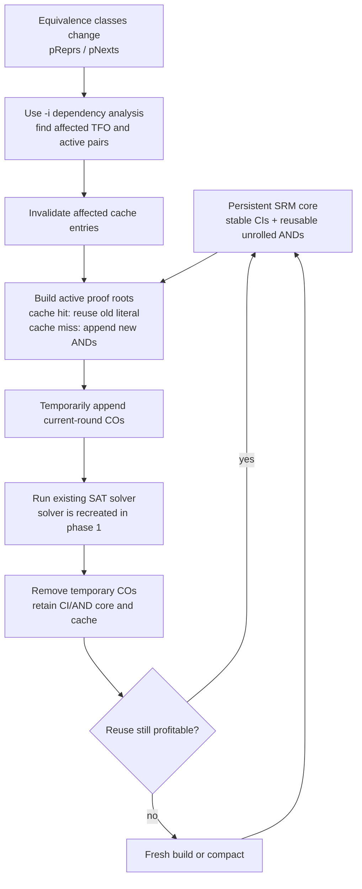

# Dynamic SRM Design for `&scorr`

Reviewed against `incre_sim_seed_v2` on 2026-06-12.

Chinese version: [dynamic_srm_design_zh.md](dynamic_srm_design_zh.md)

## Short Explanation for Discussion

Dynamic SRM keeps the unrolled CI/AND logic built in previous `&scorr` rounds
instead of rebuilding it from scratch. After equivalence classes change, it
invalidates only cached literals in the affected TFO and appends new nodes only
for cache misses. The current round's proof outputs are attached as temporary
COs, solved by the existing SAT solver, and then removed, while the reusable
CI/AND core remains for the next round. When reuse becomes poor or the resident
graph grows too large, the implementation falls back to a fresh build or
compacts the core.



The essential separation is:

```text
dynamic SRM = reuse of unrolled AIG construction
persistent SAT = reuse of CNF and learned clauses
```

The first implementation provides only dynamic SRM reuse.

## 1. Decision

The dynamic SRM should be implemented as:

```text
resident CI/AND core
    + snapshot-aware literal cache
    + immutable versioned AND nodes
    + temporary COs for the current round only
    + periodic cold compaction
```

It should not begin as:

```text
one ordinary GIA that permanently accumulates historical COs
    + a new CO-range SAT interface
```

The first design preserves the current solver and counterexample interfaces. It
also keeps the resident graph free of historical proof outputs. Persistent SAT
or CNF reuse is a separate later project.

The optimization target is only SRM construction. It does not directly reduce:

- SAT calls;
- SAT setup unless a solver is also made persistent;
- CEX resimulation;
- class refinement;
- active-set TFO bookkeeping.

This scope must be reflected in the expected speedup.

## 2. Current Baseline

The current main loop performs the following work each refinement round:

```text
diff pReprs/pNexts against the previous proof snapshot
compute the active obligation set
build a fresh active or full SRM
solve every emitted SRM output
destroy the SRM
resimulate CEX patterns and refine classes
```

Relevant implementations:

- `Gia_ManCorrSpecReduce()` in `src/proof/cec/cecCorr.c`
- `Gia_ManCorrSpecReduce_Emit()` in `src/proof/cec/cecCorrIncr.c`
- `Cec_IncrMgrComputeTfo()` in `src/proof/cec/cecCorrIncr.c`
- `Cec_ManLSCorrespondenceClasses()` in `src/proof/cec/cecCorr.c`
- `Cec_ManSatSolveMiter()` in `src/proof/cec/cecSolve.c`
- `Cbs_ManSolveMiterNc()` in `src/aig/gia/giaCSat.c`

The existing `-i` implementation already decides which proof obligations must
be rebuilt. Dynamic SRM should reuse exactly this decision. It must not create a
second definition of "active pair".

Use a separate experimental switch:

```text
-D : dynamic SRM construction in the main inductive loop
```

`-D` should be off by default and should require or internally enable the same
active-obligation filtering as `-i`. BMC remains on the current builder.
`-D -I` is supported, but dynamic construction and local CEX simulation remain
independent optimizations.

## 3. Exact SRM Semantics

### 3.1 Proof obligations

For a non-ring pair `(repr, obj)`, the proof output is built from the current
class snapshot:

```text
RealLit(repr, proof_frame)
    XOR
phase_adjust(RealLit(obj, proof_frame))
```

For ring mode, the obligation is a directed ring edge. The current builder
emits the equivalent of:

```text
adjusted_prev AND NOT(adjusted_obj)
```

It is not a per-edge XOR. The complete ring of directed implications establishes
equivalence. Dynamic SRM must preserve the current construction and
simplification rules.

The output is not an XOR of raw objects in the original sequential AIG.

### 3.2 Speculative and real literals

`SpecLit(obj, frame)` may replace `obj` by its current representative.

`RealLit(obj, frame)` does not perform that replacement on the endpoint itself,
but its fanins are recursively constructed with `SpecLit()`.

This distinction must match:

```text
Gia_ManCorrSpecReduce_rec()
Gia_ManCorrSpecReal()
```

### 3.3 The frame-0 RO exception

The current main SRM builder has an important special case:

```text
1. append one CI for every RO;
2. for every frame-0 RO with a representative,
   overwrite its copy with the representative's frame-0 CI copy.
```

Therefore this pseudo-code is wrong:

```text
RealLit(RO, 0) = the RO's own CI
```

The dynamic implementation must reproduce the existing frame-0 alias mapping:

```text
Frame0RoLit(ro):
    if ro has a representative:
        if the representative is const0:
            return 0
        return the representative's frame-0 RO literal
    return the CI allocated for ro
```

The current builder does not apply an explicit phase XOR in this frame-0 alias
assignment. The dynamic implementation must match the code exactly and protect
this behavior with differential tests.

### 3.4 CI order

The resident core must allocate all CIs once, in the same order as the current
main builder:

```text
all frame-0 ROs
then all PIs for each required frame
```

The physical CI list is stable. The logical frame-0 RO alias mapping is
snapshot-dependent.

BMC uses different initialization and prefix semantics. Dynamic SRM should
initially support only the main inductive loop.

## 4. Corrections to the Previous Draft

The previous design had four material problems.

### 4.1 Historical COs are unnecessary

The active-set proof argument carries old UNSAT results across rounds. The
resident AIG does not need to retain the old CO objects to do this.

Permanent historical COs increase memory, complicate output numbering, and make
normalization assumptions harder to audit.

### 4.2 A CO-range solver is not SAT reuse

Changing a solver loop from:

```text
solve all COs
```

to:

```text
solve COs in [start, stop)
```

does not make the SAT manager persistent. The current solvers still recreate
their internal state and perform graph setup for each call.

Range solving avoids old outputs, but it does not by itself reuse CNF, clauses,
or learned information.

### 4.3 Object-only TFO is conservative cache invalidation

`Cec_IncrMgrComputeTfo()` returns an object-level union across the bounded
unrolling. That is sufficient for active-output filtering.

It can also be used conservatively for dynamic cache invalidation by
invalidating every cached frame of each marked object. It is not a precise
`(frame,obj)` dependency result.

Precise frame-aware invalidation may be added later only if profiling justifies
the extra state.

### 4.4 Split-driven simulation worklists are unrelated

The `-I` split-TFO worklist is a local CEX-resimulation heuristic. It is not part
of SRM construction and must not be used to define dynamic SRM invalidation.

Dynamic SRM invalidation is driven by changes in the class snapshot used to
construct speculative literals.

## 5. Correctness Model

Let:

```text
S_r = pReprs/pNexts/phase snapshot used to build round r
O(pair, S_r) = proof formula emitted for that pair in round r
```

The existing active filter relies on:

```text
If the pair is not active in round r+1, then
O(pair, S_r+1) is structurally and semantically unchanged from
O(pair, S_r), whose UNSAT result is already known.
```

Dynamic SRM adds a second invariant:

```text
Every cached literal returned for (frame,obj) in round r must equal the literal
that a fresh Gia_ManCorrSpecReduce[_Emit]() build would construct under S_r.
```

These are separate concerns:

- the active-set manager decides whether an obligation needs proof;
- the dynamic manager decides whether a previously built literal can be reused.

A cache hit must never be treated as proof that an obligation can be skipped.

## 6. Recommended Architecture

### 6.1 Resident core

Keep one `Gia_Man_t` containing:

```text
constant
stable CIs
all versioned AND/XOR nodes appended so far
no persistent COs
```

Old AND nodes remain immutable. When class changes invalidate a cached mapping,
the next request appends or structurally reuses a new node and updates the
mapping.

An old node is not logically corrupted. It is only stale as the cached
implementation of a particular `(frame,obj)` under the current snapshot.

### 6.2 Temporary CO seal

For each round:

```text
build all active root literals first
record nCoreObjs
append this round's COs
solve with the existing solver
remove only the temporary CO objects
clear vCos and transient solver metadata
continue appending ANDs next round
```

At solve time the graph has the conventional layout:

```text
CIs -> ANDs -> current COs
```

The implementation must use a dedicated seal/unseal helper. It must not rely on
ad hoc edits spread through the main loop.

Before the next solve/build cycle:

- `pRefs` created by `Cbs_ManSolveMiterNc()` must be freed;
- `vLevels` and other size-dependent metadata must be resized or cleared;
- no static fanout may include temporary COs;
- the structural hash must remain valid because only unhashed COs are removed.

### 6.3 Suggested manager

```c
typedef struct Cec_DynSrm_t_ Cec_DynSrm_t;
struct Cec_DynSrm_t_
{
    Gia_Man_t * pAig;          // host sequential AIG, not owned
    Gia_Man_t * pCore;         // resident CI/AND core, owned

    int nFrames;
    int fScorr;
    int nObjs;
    int nKeys;

    Vec_Int_t * vRoCiLit;      // RO index/object -> stable physical CI literal
    Vec_Int_t * vPiCiLit;      // (frame, PI) -> stable CI literal

    Vec_Int_t * vSpecLit;      // key=(frame,obj) -> current cached literal
    Vec_Int_t * vSpecValid;    // per-key validity stamp
    Vec_Int_t * vTouchedKeys;  // sparse accounting/compaction support
    int iValidStamp;

    Vec_Int_t * vReprSnap;     // snapshot represented by cache validity
    Vec_Int_t * vNextSnap;     // audit only; pNexts does not alter logic cones

    Vec_Int_t * vRoundOutputs; // local [endpoint0, endpoint1, ...]
    Vec_Int_t * vRoundRoots;   // current proof root literals
    Vec_Int_t * vRoundOutLits; // optional endpoint literals for -I

    int nObjsBeforeCos;
    int nAppendedRound;
    int nCacheHitsRound;
    int nCacheMissesRound;
    int nCompactions;
};
```

The first implementation should cache only `SpecLit()`. `RealLit()` can call
cached speculative fanins and rely on structural hashing for its final AND.
Adding a separate real-literal cache should be measurement-driven.

## 7. Literal Construction

The dynamic functions should mirror the current builder, including preassigned
CI copies:

```text
SpecLit(obj, f):
    if obj is const:
        return 0

    if obj is a PI:
        return PiCiLit(obj, f)

    if obj is an RO and f == 0:
        return Frame0RoLit(obj, current_snapshot)

    key = Key(f, obj)
    if key is valid:
        return cached literal

    if obj has a representative and speculative reduction is enabled at f:
        lit = phase_adjust(SpecLit(repr(obj), f))
    else:
        lit = RealLit(obj, f)

    cache[key] = lit
    mark key valid
    return lit
```

```text
RealLit(obj, f):
    if obj is AND:
        return HashAnd(
            SpecLit(fanin0(obj), f),
            SpecLit(fanin1(obj), f))

    if obj is RO and f == 0:
        return Frame0RoLit(obj, current_snapshot)

    if obj is RO and f > 0:
        ri = RoToRi(obj)
        return SpecLit(fanin(ri), f - 1)
```

Representative recursion must remain acyclic. Add assertions equivalent to the
ordering assumptions used by the current class representation.

## 8. Cache Invalidation

At the start of a round:

```text
compute representative-change seeds against the proof snapshot
compute the existing bounded TFO/alias closure
for every marked object:
    invalidate all cached frames for that object
update the dynamic cache snapshot
```

Invalidating all frames is conservative but simple and safe.

The invalidation closure must include:

- ordinary combinational fanout;
- RI-to-RO transitions across the configured depth;
- representative-to-member alias edges;
- the changed object itself;
- frame-0 RO aliases affected by representative changes.

`pNexts` changes do not change speculative cone logic. They change which ring
edge obligations exist and are handled by output enumeration.

The dynamic cache snapshot and the active-proof snapshot are conceptually
different. The implementation may consume the same diff/TFO result, but it
must not silently assume that a fresh-builder fallback updated the resident
cache.

## 9. Output Enumeration

Do not duplicate the non-ring and ring loops in a third builder.

Refactor the current pair enumeration into a shared callback-style helper:

```text
EnumerateCurrentObligations(mode, callback)
```

The callback receives:

```text
endpoint0
endpoint1
phase relation
ring/non-ring kind
active reason
```

The fresh builder and dynamic builder should use the same enumerator. This
prevents drift in:

- constant-class handling;
- ring closing edges;
- `Cec_IncrMgrRingEdgeChanged()`;
- phase adjustment;
- simplified-away outputs;
- `vOutputs` ordering.

For each active obligation, the dynamic builder creates the current root
literal and pushes a local endpoint pair. Temporary CO indexes are therefore
local and match `vStatus` and `vCexStore` without a range API.

## 10. Round Lifecycle

Recommended main-loop integration:

```text
1. Compute repr/next changes and active obligations using Cec_IncrMgr.
2. Advance the dynamic cache snapshot and invalidate affected keys.
3. Estimate dynamic append work.
4. Choose dynamic build or existing fresh build.
5. If dynamic:
       build all current roots in pCore
       snapshot classes for the active-proof manager
       append temporary COs
       call the existing SAT/CBS solver
       remove temporary COs and solver-derived metadata
6. If fresh fallback:
       call the current builder unchanged
       snapshot classes at the current location
7. Run the existing CEX/resimulation/refinement path unchanged.
```

Round zero is a cold dynamic build or the existing full build. It must not claim
reuse before any cache has been established.

## 11. Fallback and Compaction

### 11.1 Build fallback

Use measured work, not only active-pair ratio.

Possible fallback conditions:

```text
active_pairs > 70% of total pairs
estimated dynamic misses exceed estimated fresh active nodes
dynamic append in the previous round exceeded fresh build size
resident memory budget is exceeded
unsupported solver mode or graph metadata is present
```

If a fresh fallback is selected, either:

- still apply cache invalidation and retain unaffected entries; or
- cold-reset the dynamic cache.

Do not update the cache snapshot without doing one of these.

### 11.2 Compaction

Compaction creates a new resident core with only stable CIs and an empty cache.
Lazy reconstruction is preferred over copying all "live" cached nodes.

Suggested initial triggers:

```text
resident AND count > 2x the post-compaction high-water mark
estimated stale-key ratio > 50%
resident memory exceeds a configured budget
three consecutive rounds append more than 70% of a fresh active SRM
```

These thresholds are starting points, not correctness constants.

## 12. Solver Interaction

Phase 1 must use the existing solver APIs unchanged.

For `Cec_ManSatSolveMiter()`:

- the SAT manager is recreated each round;
- setup and CNF state are not reused;
- temporary output numbering works without modification.

For `Cbs_ManSolveMiterNc()`:

- `Gia_ManCreateRefs()` leaves `pCore->pRefs` allocated;
- the dynamic unseal helper must release it before the graph grows or CBS runs
  again;
- call with `f0Proved = 0` so the solver does not patch temporary CO drivers.

Persistent SAT should be a separate phase using activation assumptions or a
dedicated incremental solver manager. It must not be presented as part of the
initial dynamic SRM result.

## 13. Cost Model and Go/No-Go Gate

The logs currently in this directory show that SRM construction is meaningful
but not dominant:

```text
BGEU incremental log:
    wall  = 152.301 s
    SRM   =  13.577 s
    active-set bookkeeping + snapshot ~= 2.422 s

BLT incremental log:
    wall  = 166.706 s
    SRM   =  15.254 s
    active-set bookkeeping + snapshot ~= 2.423 s
```

Other logs show fresh SRM construction around 21.9-22.5 seconds, but the runs
have different refinement trajectories and should not be treated as a strict
paired benchmark.

Consequences:

- eliminating 50% of incremental SRM build time saves only about 4-5% total on
  these runs before dynamic-cache overhead;
- dynamic SRM cannot recover SAT or simulation time by itself;
- large resident memory or frequent compaction can erase the gain.

Before implementation, add an estimator to the current fresh builder:

```text
dyn_est_active_pairs
dyn_est_cache_hits
dyn_est_cache_misses
dyn_est_append_ands
fresh_active_ands
dyn_resident_ands
dyn_stale_keys
```

Proceed only if representative workloads predict a substantial reduction in
appended ANDs, not merely a reduction in output count.

## 14. Implementation Plan

### Phase 0: Restore default-path parity

The current branch calls `Cec_ManTrivialSatSplit()` when trivial SAT outputs are
present even if `-i`, `-I`, and `-s` are disabled. This differs from
`origin/master`.

Gate this behavior behind an explicit experimental option before introducing
another optimization path.

### Phase 1: Instrumentation only

Measure would-hit, would-miss, would-append, resident growth, and fresh active
SRM size without changing behavior.

### Phase 2: Resident core with temporary COs

Implement:

- stable CIs;
- exact frame-0 RO alias semantics;
- `SpecLit/RealLit`;
- conservative invalidation;
- shared obligation enumeration;
- seal, solve, and unseal;
- differential oracle mode.

Use the existing solver APIs.

### Phase 3: Fallback and compaction

Enable dynamic mode only when the estimator predicts a win. Add cold compaction
and memory limits.

### Phase 4: Optional persistent SAT

Only after dynamic construction is independently correct and profitable,
evaluate persistent CNF and learned-clause reuse.

## 15. Validation

### 15.1 Differential SRM oracle

For the same snapshot and active set:

```text
build fresh active SRM
build dynamic temporary-output SRM
assert identical endpoint ordering
prove XOR(fresh_output_i, dynamic_output_i) == 0 for every i
```

Random simulation alone is useful for debugging but is not the final oracle.

### 15.2 Required test matrix

```text
ring off/on
CSAT off/on
-I off/on
constant classes
trivial SAT outputs
timeout/fail outputs
repr-only changes
pNexts-only ring rewiring
large and tiny TFOs
no-change convergence
fresh fallback
compaction between rounds
frame-0 RO representative changes
```

### 15.3 Required invariants

1. CI order is identical to the current main SRM builder.
2. Frame-0 RO aliases match the current builder exactly.
3. Old AND nodes are immutable.
4. Temporary CO indexes are local to the current round.
5. No temporary CO remains after unseal.
6. Every valid cached literal matches a fresh build under the current snapshot.
7. Ring-edge changes are emitted even when logic-cone cache entries remain valid.
8. Fresh fallback calls the current builder and solver path unchanged.
9. Dynamic mode does not depend on the `-I` split-worklist state.
10. Compaction changes performance only, never emitted obligations.

## 16. Recommendation

Do not implement permanent historical CO accumulation or range SAT first.

The lowest-risk experiment is:

```text
shared obligation enumerator
    -> resident CI/AND core
    -> exact snapshot invalidation
    -> temporary current-round COs
    -> existing solver
    -> CO rollback
```

The instrumentation phase is mandatory. If cache misses track fresh active SRM
size, dynamic SRM should be abandoned or restricted to workloads with stable
cones. The design is worthwhile only when literal reuse is high enough to
offset cache invalidation, resident-memory pressure, and compaction.
