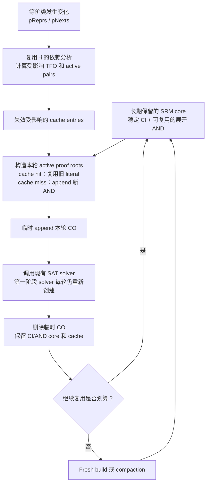

# `&scorr` 动态 SRM 设计

基于 `incre_sim_seed_v2`，于 2026-06-12 重新审查。

英文版：[dynamic_srm_design.md](dynamic_srm_design.md)

## 给 Professor 的简短说明

动态 SRM 的核心是：不再每轮从头构造展开后的 SRM，而是长期保留已经构造好的
CI/AND 逻辑。等价类变化后，只失效其影响 TFO 内的 cached literals；本轮构造
active proof roots 时，cache hit 直接复用旧 literal，cache miss 才 append 新
AND。随后临时挂上本轮 CO，调用现有 SAT solver，求解结束后删除 CO，但保留
CI/AND core 给下一轮使用。当复用率太低或 resident graph 过大时，再 fallback
到 fresh build 或执行 compaction。



需要特别区分：

```text
动态 SRM = 复用展开 AIG 的构造结果
Persistent SAT = 复用 CNF 和 learned clauses
```

第一阶段只实现动态 SRM，不实现 persistent SAT。

## 1. 设计结论

动态 SRM 推荐实现为：

```text
长期存在的 CI/AND 核心图
    + 与 class snapshot 绑定的 literal cache
    + 不可变、带版本的新增 AND 节点
    + 只在当前轮临时存在的 CO
    + 周期性的冷 compaction
```

第一版不推荐实现为：

```text
一个永久累积历史 CO 的普通 GIA
    + 新增只求解某段 CO 的 SAT range 接口
```

推荐方案能够保持当前 SAT 和 CEX 接口不变，也不会在 resident SRM 中
保存历史 proof outputs。持久化 SAT/CNF 是另一个独立项目，不应和第一版
动态 SRM 混在一起。

这个优化直接针对的只有 SRM 构建时间。它不会直接减少：

- SAT calls；
- SAT setup，除非同时持久化 solver；
- CEX resimulation；
- class refinement；
- active-set 的 TFO bookkeeping。

因此性能预期必须遵守这个边界。

## 2. 当前基线流程

当前主循环每一轮大致执行：

```text
比较当前 pReprs/pNexts 与上一轮 proof snapshot
计算需要重新证明的 active obligations
重新构造一张 active 或 full SRM
求解该 SRM 的全部输出
销毁 SRM
使用 CEX 做 resimulation 并 refine classes
```

对应实现包括：

- `src/proof/cec/cecCorr.c` 中的 `Gia_ManCorrSpecReduce()`
- `src/proof/cec/cecCorrIncr.c` 中的 `Gia_ManCorrSpecReduce_Emit()`
- `src/proof/cec/cecCorrIncr.c` 中的 `Cec_IncrMgrComputeTfo()`
- `src/proof/cec/cecCorr.c` 中的 `Cec_ManLSCorrespondenceClasses()`
- `src/proof/cec/cecSolve.c` 中的 `Cec_ManSatSolveMiter()`
- `src/aig/gia/giaCSat.c` 中的 `Cbs_ManSolveMiterNc()`

现有 `-i` 已经负责决定哪些 proof obligations 必须重新构建。动态 SRM
应该严格复用这个判断，不能再发明一套不同的 active-pair 定义。

使用单独的实验开关：

```text
-D : 在主 inductive loop 中启用 dynamic SRM construction
```

`-D` 默认关闭，并且应要求或内部启用与 `-i` 相同的 active-obligation 过滤。
BMC 继续使用当前 builder。可以支持 `-D -I`，但 dynamic construction 与局部
CEX simulation 仍是两个互相独立的优化。

## 3. SRM 的精确语义

### 3.1 Proof obligation

对于非 ring 的 `(repr, obj)`，当前 class snapshot 下的 proof output 是：

```text
RealLit(repr, proof_frame)
    XOR
phase_adjust(RealLit(obj, proof_frame))
```

ring 模式证明的是带方向的 ring edge。当前 builder 实际产生：

```text
adjusted_prev AND NOT(adjusted_obj)
```

它不是每条 edge 上的 XOR。完整 ring 的有向 implications 共同建立 equivalence。
动态 SRM 必须保持当前的构造和化简规则。

因此 proof output 不是原始 sequential AIG 中两个 raw object 的直接 XOR。

### 3.2 Speculative literal 与 real literal

`SpecLit(obj, frame)` 可以根据当前 `pReprs` 用 representative 替换 `obj`。

`RealLit(obj, frame)` 不替换 endpoint 本身，但它递归构造 fanin 时使用
`SpecLit()`。

这两个函数必须精确复刻：

```text
Gia_ManCorrSpecReduce_rec()
Gia_ManCorrSpecReal()
```

### 3.3 frame-0 RO 的特殊语义

当前主 SRM builder 有一个容易遗漏的特殊步骤：

```text
1. 为每个 RO append 一个 CI；
2. 如果 frame-0 RO 有 representative，
   将它的 copy 改成 representative 的 frame-0 CI copy。
```

因此下面的伪代码是错误的：

```text
RealLit(RO, 0) = 这个 RO 自己的 CI
```

动态实现必须复刻现有的 frame-0 alias：

```text
Frame0RoLit(ro):
    如果 ro 有 representative:
        如果 representative 是 const0:
            返回 0
        返回 representative 的 frame-0 RO literal
    否则:
        返回为 ro 分配的物理 CI
```

当前代码在这个 frame-0 alias 赋值中没有显式加入 phase XOR。动态实现应先
严格匹配现有代码，并通过 differential test 固定这个行为，而不是自行修改
语义。

### 3.4 CI 顺序

resident core 初始化时必须一次性按照当前主 builder 的顺序创建 CI：

```text
所有 frame-0 RO
然后按 frame 顺序创建所有 PI
```

物理 CI 列表长期不变，但 frame-0 RO 到这些 CI 的逻辑 alias 会随 snapshot
变化。

BMC 有不同的初始化和 prefix 语义。第一版动态 SRM 只支持主 inductive loop，
不支持 BMC。

## 4. 对旧设计的主要修正

旧设计存在四个实质性问题。

### 4.1 不需要永久保存历史 CO

跨轮复用旧 UNSAT 结论依靠的是 active-set 的正确性证明，而不是 resident AIG
中仍然保存旧 CO。

永久保存历史 CO 会增加内存、复杂化 output numbering，也会增加对 GIA
normalization 假设的依赖。

### 4.2 CO range solver 不等于 SAT reuse

把 solver 的循环从：

```text
求解全部 CO
```

改成：

```text
只求解 [start, stop) 中的 CO
```

不会自动得到 persistent SAT。当前 solver 每次调用仍会重新创建内部状态并
执行 graph setup。

range solve 只能避免重新访问旧输出，不能自动复用 CNF、clauses 或 learned
information。

### 4.3 object-level TFO 只能做保守失效

`Cec_IncrMgrComputeTfo()` 返回的是有界展开范围内的 object-level union。
它足以支持当前 active-output 过滤。

动态 cache 也可以保守地使用它：只要 object 被标记，就失效该 object 的全部
frame cache。但它不是精确的 `(frame,obj)` dependency 结果。

只有 profiling 证明有价值时，才值得增加精确 frame-aware invalidation。

### 4.4 split-driven simulation worklist 与动态 SRM 无关

`-I` 中的 split-TFO worklist 是局部 CEX resimulation 的启发式扩展。它不属于
SRM construction，也不能用于定义动态 SRM cache 的失效范围。

动态 SRM 的失效只能由构造 speculative literal 时使用的 class snapshot 变化
驱动。

## 5. 正确性模型

定义：

```text
S_r = 构造第 r 轮 SRM 时使用的 pReprs/pNexts/phase snapshot
O(pair, S_r) = 该 snapshot 下 pair 对应的 proof formula
```

现有 active filter 依赖下面的性质：

```text
如果 pair 在第 r+1 轮不是 active，
那么 O(pair, S_r+1) 与已经证明 UNSAT 的 O(pair, S_r)
在结构和语义上都没有变化。
```

动态 SRM 额外要求：

```text
第 r 轮返回的每一个 cached (frame,obj) literal，
都必须等于 fresh Gia_ManCorrSpecReduce[_Emit]() 在 S_r 下构造的 literal。
```

这是两个不同的问题：

- active-set manager 判断 obligation 是否需要重新证明；
- dynamic manager 判断以前构造的 literal 是否可以复用。

cache hit 绝不能被当作跳过 proof obligation 的依据。

## 6. 推荐架构

### 6.1 Resident core

长期保留一个只包含下列对象的 `Gia_Man_t`：

```text
constant
稳定 CI
历轮 append 的带版本 AND/XOR 节点
不包含永久 CO
```

旧 AND 节点永远不修改。当 class 变化使某个 cache mapping 失效时，下一次请求
会 append 新版本节点，或者通过 structural hashing 复用已经存在的等价节点，
然后更新 mapping。

旧节点本身并没有变成错误逻辑。失效的是“它仍然代表当前 snapshot 下某个
`(frame,obj)`”这个 cache 关系。

### 6.2 每轮临时 seal CO

每一轮按下面的方式工作：

```text
先构造全部 active root literals
记录 nCoreObjs
append 当前轮临时 CO
调用现有 solver
删除这些临时 CO objects
清空 vCos 和 solver 派生状态
下一轮继续 append AND
```

在调用 solver 时，图仍保持常规布局：

```text
CIs -> ANDs -> 当前轮 COs
```

必须用专门的 seal/unseal helper 实现，不能在主循环中分散地直接修改内部字段。

进入下一轮前需要保证：

- 释放 `Cbs_ManSolveMiterNc()` 创建并留在 `pCore->pRefs` 中的数据；
- resize 或清理 `vLevels` 等依赖 object 数量的 metadata；
- static fanout 中不能保留临时 CO；
- 只删除没有进入 structural hash 的 CO，因此 hash table 仍然有效。

### 6.3 建议的数据结构

```c
typedef struct Cec_DynSrm_t_ Cec_DynSrm_t;
struct Cec_DynSrm_t_
{
    Gia_Man_t * pAig;          // 原 sequential AIG，不拥有
    Gia_Man_t * pCore;         // resident CI/AND core，拥有

    int nFrames;
    int fScorr;
    int nObjs;
    int nKeys;

    Vec_Int_t * vRoCiLit;      // RO -> 稳定的物理 CI literal
    Vec_Int_t * vPiCiLit;      // (frame, PI) -> 稳定 CI literal

    Vec_Int_t * vSpecLit;      // key=(frame,obj) -> 当前 cached literal
    Vec_Int_t * vSpecValid;    // 每个 key 的有效 stamp
    Vec_Int_t * vTouchedKeys;  // 稀疏统计和 compaction
    int iValidStamp;

    Vec_Int_t * vReprSnap;     // cache validity 对应的 snapshot
    Vec_Int_t * vNextSnap;     // 只用于审计；pNexts 不改变 logic cone

    Vec_Int_t * vRoundOutputs; // 当前轮 endpoint pairs
    Vec_Int_t * vRoundRoots;   // 当前轮 proof root literals
    Vec_Int_t * vRoundOutLits; // 可选，为 -I 保存 endpoint literals

    int nObjsBeforeCos;
    int nAppendedRound;
    int nCacheHitsRound;
    int nCacheMissesRound;
    int nCompactions;
};
```

第一版只 cache `SpecLit()`。`RealLit()` 可以使用已经 cache 的 speculative
fanins，并依靠 structural hashing 复用最终 AND。是否增加 real-literal cache
应该由测量决定。

## 7. Literal 构造

动态函数必须复刻当前 builder 中“CI copy 已预先赋值”的语义：

```text
SpecLit(obj, f):
    如果 obj 是 const:
        返回 0

    如果 obj 是 PI:
        返回 PiCiLit(obj, f)

    如果 obj 是 RO 且 f == 0:
        返回当前 snapshot 下的 Frame0RoLit(obj)

    key = Key(f, obj)
    如果 key 有效:
        返回 cached literal

    如果 obj 在 f 上允许 speculative reduction 且存在 representative:
        lit = phase_adjust(SpecLit(repr(obj), f))
    否则:
        lit = RealLit(obj, f)

    cache[key] = lit
    标记 key 有效
    返回 lit
```

```text
RealLit(obj, f):
    如果 obj 是 AND:
        返回 HashAnd(
            SpecLit(fanin0(obj), f),
            SpecLit(fanin1(obj), f))

    如果 obj 是 RO 且 f == 0:
        返回当前 snapshot 下的 Frame0RoLit(obj)

    如果 obj 是 RO 且 f > 0:
        ri = RoToRi(obj)
        返回 SpecLit(fanin(ri), f - 1)
```

representative recursion 必须保持无环。实现中应加入与当前 class 表示顺序一致
的 assertion。

## 8. Cache 失效

每轮开始时：

```text
相对上一轮 proof snapshot 计算 repr-change seeds
计算现有的 bounded TFO/alias closure
对每个被标记 object:
    失效该 object 的全部 frame cache
更新 dynamic cache snapshot
```

失效全部 frame 比较保守，但第一版简单且安全。

失效 closure 必须覆盖：

- 普通 combinational fanout；
- 在配置深度内通过 RI-to-RO 跨 frame；
- representative-to-member alias edges；
- changed object 自身；
- representative 变化影响的 frame-0 RO alias。

`pNexts` 变化不会改变 speculative logic cone，只会改变当前存在的 ring edge
obligation，因此由 output enumeration 处理。

dynamic cache snapshot 与 active-proof snapshot 在概念上不同。两者可以使用同
一份 diff/TFO 结果，但不能因为某轮使用 fresh-builder fallback，就假设 resident
cache 已经自动更新。

## 9. Output enumeration

不要把 non-ring 和 ring 的遍历循环复制到第三个 builder 中。

应该把现有 pair enumeration 重构成共享的 callback helper：

```text
EnumerateCurrentObligations(mode, callback)
```

callback 接收：

```text
endpoint0
endpoint1
phase relation
ring/non-ring 类型
active 原因
```

fresh builder 和 dynamic builder 使用完全相同的 enumerator，从而避免以下行为
逐渐不一致：

- constant-class 处理；
- ring closing edge；
- `Cec_IncrMgrRingEdgeChanged()`；
- phase adjustment；
- 被化简掉的 outputs；
- `vOutputs` 顺序。

dynamic builder 为每个 active obligation 构造当前 root literal，并压入当前轮
局部 endpoint pair。临时 CO index 因而天然与 `vStatus` 和 `vCexStore` 对齐，
不需要 range API。

## 10. 每轮生命周期

推荐的主循环接入方式：

```text
1. 使用 Cec_IncrMgr 计算 repr/next changes 和 active obligations。
2. 推进 dynamic cache snapshot，并失效受影响 keys。
3. 估计本轮 dynamic append 工作量。
4. 选择 dynamic build 或现有 fresh build。
5. 如果使用 dynamic：
       在 pCore 中构造全部当前 roots
       为 active-proof manager snapshot 当前 classes
       append 临时 CO
       调用现有 SAT/CBS solver
       删除临时 CO 和 solver-derived metadata
6. 如果 fresh fallback：
       原样调用当前 builder
       在当前既有位置 snapshot classes
7. 原样执行当前 CEX/resimulation/refinement 流程。
```

第 0 轮只能是 cold dynamic build 或现有 full build，不能在尚未建立 cache 时声称
发生复用。

## 11. Fallback 与 compaction

### 11.1 Build fallback

fallback 应根据测得的构建工作量，而不应只根据 active-pair ratio。

候选条件：

```text
active_pairs > total_pairs 的 70%
dynamic cache misses 估计超过 fresh active nodes
上一轮 dynamic append 超过 fresh build 大小
resident memory 超过预算
当前 solver mode 或 graph metadata 尚未支持
```

如果选择 fresh fallback，必须二选一：

- 仍执行 cache invalidation，保留不受影响 entries；
- 对 dynamic cache 做 cold reset。

不能只更新 cache snapshot 而不执行其中任何一种。

### 11.2 Compaction

compaction 创建一个只含稳定 CI 的新 resident core，并清空 cache。优先采用
lazy reconstruction，而不是尝试复制所有“仍然 live”的 cached nodes。

建议的初始触发条件：

```text
resident AND 数量 > 上次 compaction 后 high-water mark 的 2 倍
估计 stale-key ratio > 50%
resident memory 超过配置预算
连续三轮 append 超过 fresh active SRM 的 70%
```

这些阈值只是初始策略，不属于 correctness 条件。

## 12. Solver 交互

Phase 1 必须保持现有 solver API 不变。

对于 `Cec_ManSatSolveMiter()`：

- 每轮仍重新创建 SAT manager；
- setup 和 CNF 不复用；
- 临时 output numbering 不需要修改接口。

对于 `Cbs_ManSolveMiterNc()`：

- `Gia_ManCreateRefs()` 会把数据保留在 `pCore->pRefs`；
- dynamic unseal helper 必须在图继续增长或再次运行 CBS 前释放它；
- 必须使用 `f0Proved = 0`，避免 solver 修改临时 CO driver。

persistent SAT 应作为后续独立阶段，使用 activation assumptions 或专门的
incremental solver manager。第一版动态 SRM 不能把它算进已有收益。

## 13. 成本模型与 go/no-go 条件

当前目录日志表明 SRM construction 有一定占比，但不是主导成本：

```text
BGEU incremental log:
    wall  = 152.301 s
    SRM   =  13.577 s
    active-set bookkeeping + snapshot ~= 2.422 s

BLT incremental log:
    wall  = 166.706 s
    SRM   =  15.254 s
    active-set bookkeeping + snapshot ~= 2.423 s
```

其他日志中的 fresh SRM construction 大约为 21.9-22.5 秒，但这些运行的
refinement trajectory 不同，不能当作严格配对 benchmark。

由此得到：

- 即使消除 50% 的 incremental SRM build，在这些运行上总时间也只减少约
  4-5%，还没有扣除 dynamic-cache 开销；
- 动态 SRM 本身不能回收 SAT 或 simulation 时间；
- resident memory 或频繁 compaction 很容易抵消收益。

正式实现前，先在 fresh builder 中增加 estimator：

```text
dyn_est_active_pairs
dyn_est_cache_hits
dyn_est_cache_misses
dyn_est_append_ands
fresh_active_ands
dyn_resident_ands
dyn_stale_keys
```

只有代表性 workload 显示 appended ANDs 显著减少时才继续，而不能只看输出数量
减少。

## 14. 实现计划

### Phase 0：恢复默认路径一致性

当前分支在 `-i`、`-I`、`-s` 都关闭时，只要存在 trivial SAT output，仍会调用
`Cec_ManTrivialSatSplit()`。这与 `origin/master` 不同。

引入新的优化路径前，应先把该行为放到显式 experimental option 后面。

### Phase 1：只做 instrumentation

在不改变行为的情况下统计 would-hit、would-miss、would-append、resident growth
以及 fresh active SRM 大小。

### Phase 2：Resident core 与临时 CO

实现：

- 稳定 CI；
- 精确的 frame-0 RO alias；
- `SpecLit/RealLit`；
- 保守 cache invalidation；
- 共享 obligation enumeration；
- seal、solve、unseal；
- differential oracle mode。

继续使用现有 solver API。

### Phase 3：Fallback 与 compaction

只有 estimator 预测有收益时才启用 dynamic mode，并加入 cold compaction 和内存
上限。

### Phase 4：可选 persistent SAT

只有在动态 construction 已独立证明正确且有收益后，才评估 persistent CNF 和
learned-clause reuse。

## 15. 验证方案

### 15.1 Differential SRM oracle

对同一 snapshot 和 active set：

```text
构造 fresh active SRM
构造 dynamic temporary-output SRM
assert endpoint 顺序完全一致
逐个证明 XOR(fresh_output_i, dynamic_output_i) == 0
```

随机 simulation 可以用于调试，但不能作为最终 correctness oracle。

### 15.2 必测矩阵

```text
ring off/on
CSAT off/on
-I off/on
constant classes
trivial SAT outputs
timeout/fail outputs
只有 repr 变化
只有 pNexts ring rewiring
大 TFO 和小 TFO
无变化 convergence
fresh fallback
轮间 compaction
frame-0 RO representative 变化
```

### 15.3 必须保持的 invariant

1. CI 顺序与当前主 SRM builder 完全一致。
2. frame-0 RO alias 与当前 builder 完全一致。
3. 旧 AND 节点永不修改。
4. 临时 CO index 只属于当前轮。
5. unseal 后不能残留任何临时 CO。
6. 每个 valid cached literal 都等价于当前 snapshot 下的 fresh build。
7. ring edge 变化即使不影响 logic cache，也必须产生新 obligation。
8. fresh fallback 原样调用当前 builder 和 solver 路径。
9. dynamic mode 不依赖 `-I` split-worklist 状态。
10. compaction 只能影响性能，不能改变 emitted obligations。

## 16. 最终建议

不要首先实现永久历史 CO 或 range SAT。

最低风险的实验顺序是：

```text
共享 obligation enumerator
    -> resident CI/AND core
    -> 精确 snapshot invalidation
    -> 当前轮临时 CO
    -> 现有 solver
    -> CO rollback
```

instrumentation phase 是必需的。如果 cache misses 与 fresh active SRM 大小接近，
就应该放弃动态 SRM，或者只在 cone 高度稳定的 workload 上启用。只有 literal
reuse 足以覆盖 cache invalidation、resident memory 和 compaction 成本时，这个
设计才值得继续实现。
