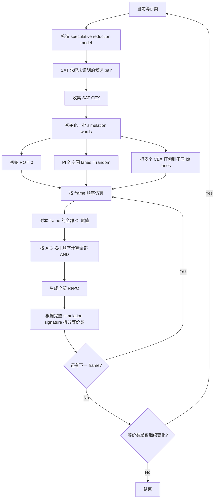
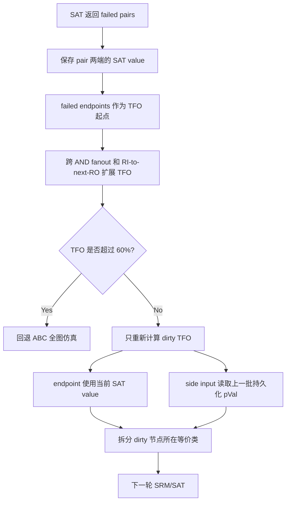
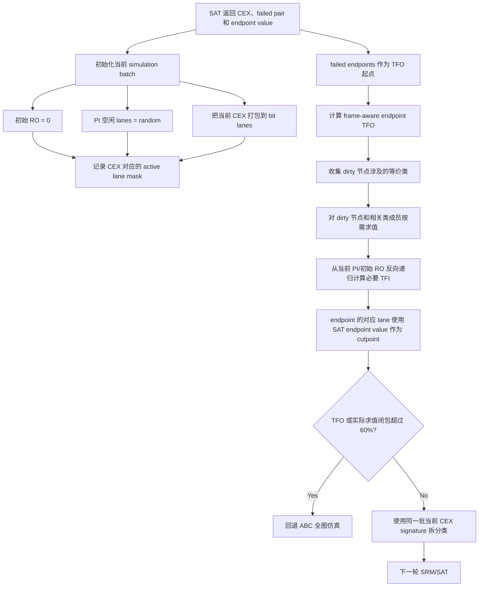
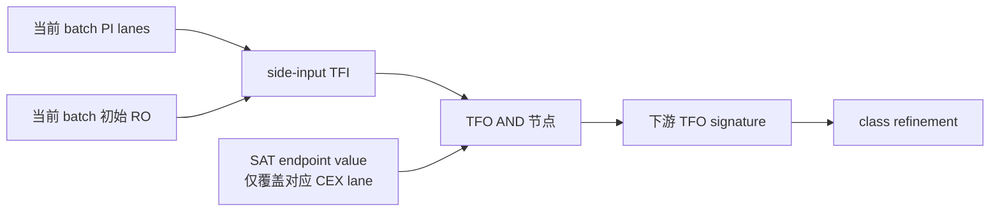

# &scorr Simulation Flow Comparison

本文用于对比三种 `&scorr` 反例仿真流程：

1. ABC `master` 的全图位并行仿真；
2. `incre_sim_seed` 的持久化 failed-endpoint TFO 仿真；
3. `incre_sim_seed_v2` 的当前 CEX 驱动、按需 TFI 求值方案。

## 1. ABC master：全图位并行仿真

### 总体流程



### 位并行计算

一个 `unsigned` 同时保存 32 个 pattern：

```text
fan0 = 10110010...
fan1 = 01110100...
node = fan0 & fan1
```

一次机器字 AND 同时完成 32 次布尔仿真。若每个节点有 `W` 个
simulation words、展开 `F` 个 frame、AIG 有 `N` 个节点，则主要计算量为：

```text
O(F * N * W)
```

全图仿真的关键性质是：每个节点和它的所有 side inputs 都来自同一批
PI/初始状态 pattern，因此每个 bit lane 都对应一个完整、可实现的输入赋值。

## 2. incre_sim_seed：持久化 endpoint-TFO

### 总体流程



### 节省的操作

该方案不再遍历所有 AIG 节点，只沿 failed endpoints 的 TFO 前向计算：

```text
近似成本 = O(|TFO| * W)
```

### 持久化 side input 的问题

假设当前 CEX lane 要求 endpoint `a = 1`，TFO 内有：

```text
c = a & s
```

旧实现中：

```text
a = 当前 SAT CEX 的值
s = 上一批 simulation 留在 pVal 中的值
```

`a` 和 `s` 可能来自两个不同的 PI assignment。因此 `(a, s)` 的组合未必是
任何真实输入能够同时产生的 pattern。使用这种混合 signature 拆分类，可能产生
over-refinement：拆分本身由一个不一致的局部 pattern 触发，而不是当前 CEX 的
完整输入赋值触发。

这种实现保留了更小的计算范围，但局部 simulation signature 不等价于 ABC
对当前 CEX 做一次完整仿真的结果。

## 3. incre_sim_seed_v2：当前 CEX + 按需 TFI

### 总体流程



### 单个 TFO 节点的求值



对于需要计算的 `(frame, object, word)`：

1. 只处理 `active lane mask` 中真实 CEX 所在的 lanes；
2. endpoint lane 直接使用 SAT 保存的 endpoint value；
3. 非 endpoint side input 从当前 batch 的 PI 或 frame-0 RO 开始递归求值；
4. frame 大于 0 的 RO 递归到前一 frame 的 RI driver；
5. 每个 `(frame, object, lane)` 用 mask 缓存，同一批内不重复求值；
6. dirty 节点所在类的所有成员都在同一批 active lanes 上求值后再 regroup。

### 位并行是否保留

保留。v2 仍使用 `unsigned` words，并用 bit mask 标记当前批次中的真实 CEX
lanes。区别是：

- master 对 word 中全部 lanes、全部节点做前向计算；
- v2 对同一 word 中的 active CEX lanes 做按需递归计算；
- 一个布尔字运算仍然并行处理最多 32 个 CEX lanes。

因此 v2 损失的是全图连续拓扑扫描的局部性，保留的是 bit-level parallelism。

### v2 的实际计算范围

v2 不只是计算纯 TFO。其必要范围为：

```text
failed endpoint TFO
+ TFO 节点求值所需的 side-input TFI
+ dirty 节点所在等价类成员的必要 TFI
```

近似成本为：

```text
O((|TFO| + |required TFI/class closure|) * active words)
```

如果该闭包超过展开 AIG `(frames * objects)` 的 60%，直接使用全图仿真，避免
递归、mask 和随机访存的管理成本在大 cone 上反而高于顺序扫描。

## 4. 三种方案对比

| 属性 | ABC master | incre_sim_seed | incre_sim_seed_v2 |
|---|---|---|---|
| 节点范围 | 全部节点 | endpoint TFO | endpoint TFO + 必要 TFI/类闭包 |
| pattern 来源 | 当前完整 batch | endpoint 当前值 + side input 旧值 | 当前完整 batch |
| side input | 全图前向算出 | 继承旧 `pVal` | 从当前 PI/RO 按需求值 |
| 位并行 | 全 lanes | 全 words | active CEX lanes 的 masked words |
| 类成员值 | 全部已计算 | 可能保留旧值 | 相关类成员当前批次重算 |
| over-refinement 风险 | 无混合 pattern | 存在混合 pattern 风险 | 消除旧 side-input 混合风险 |
| 小 cone 成本 | 高 | 最低 | 低于全图，高于持久化方案 |
| 大 cone 处理 | 固定全图 | 60% fallback | TFO 和实际求值闭包均做 60% fallback |

## 5. v2 中仍保留的状态

`pVal` 仍然是 dense storage，但普通 data lanes 只有带当前
`nEvalVersion`/`pEvalMask` 标记时才可读取。上一批的 data lanes 不再作为
side inputs。

唯一跨批保留的是完整仿真建立的 bit 0 phase anchor。ABC 使用 bit 0 判断两个
signature 应按同相还是反相比较；CEX 从 bit 1 开始打包，因此该确定性 phase
bit 不属于随机 side input，也不会与当前 CEX 混合。

第一批仍执行标准全图仿真，用于建立 phase anchor。后续发生 fallback 时，全图
仿真也会刷新 dense storage。

## 6. 正确性边界

v2 保证：在被选择的 endpoint TFO 及相关等价类中，所有参与 refinement 的
普通 fanin 值来自同一个当前 CEX batch，不再使用上一批随机输入。

v2 仍不是 master 全图 simulation 的完全等价替代：

- 它不会利用 TFO 外随机 lanes 产生的 opportunistic splits；
- 它只在真实 CEX lanes 上做局部 refinement；
- 它把 SAT 保存的 endpoint value 当作 cutpoint 的权威值。

最后一点是当前实验的剩余假设：SRM/SAT 返回的 endpoint value 必须与该 CEX
在 host AIG 对应节点上的值一致。`codex/debug-i-shadow-oracle` 中的 `-i`
修复被保留；若后续还要严格验证 endpoint cutpoint，可增加 shadow full
evaluation profiling，对比 SAT endpoint value 与 host-AIG demand evaluation，
但不应放入默认性能路径。

## 7. 对应代码

- 当前 CEX batch 初始化、CEX packing 和 remapping：
  `src/proof/cec/cecCorr.c`
- endpoint TFO、masked demand evaluation、class closure 和 fallback：
  `src/proof/cec/cecCorrIncrSim.c`
- v2 manager 数据结构：
  `src/proof/cec/cecInt.h`
- debug 基线：
  `codex/debug-i-shadow-oracle` commit `36f13bc92`
- v2 实验分支：
  `incre_sim_seed_v2`
