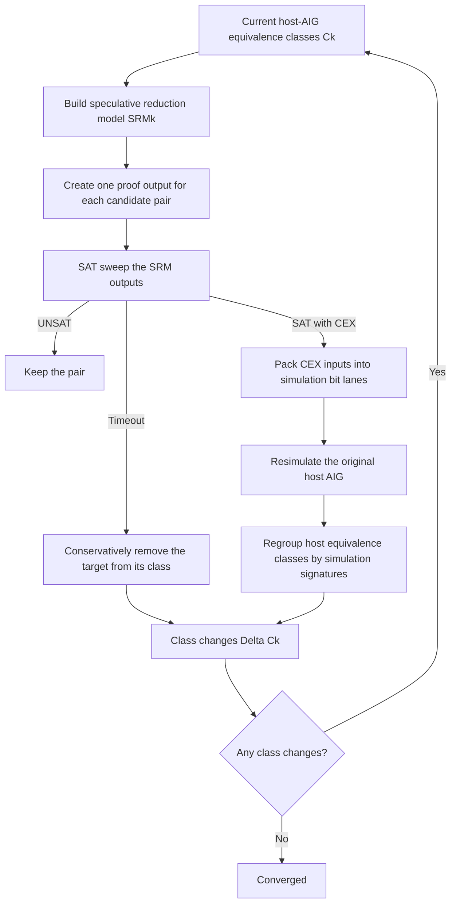
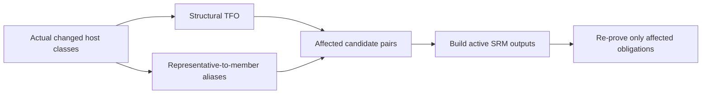
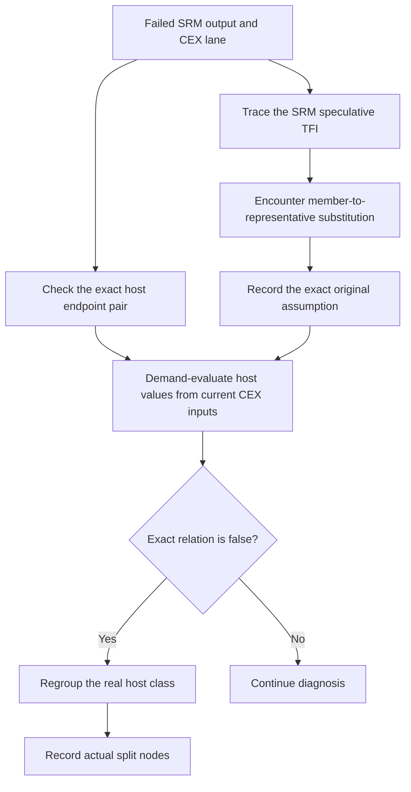
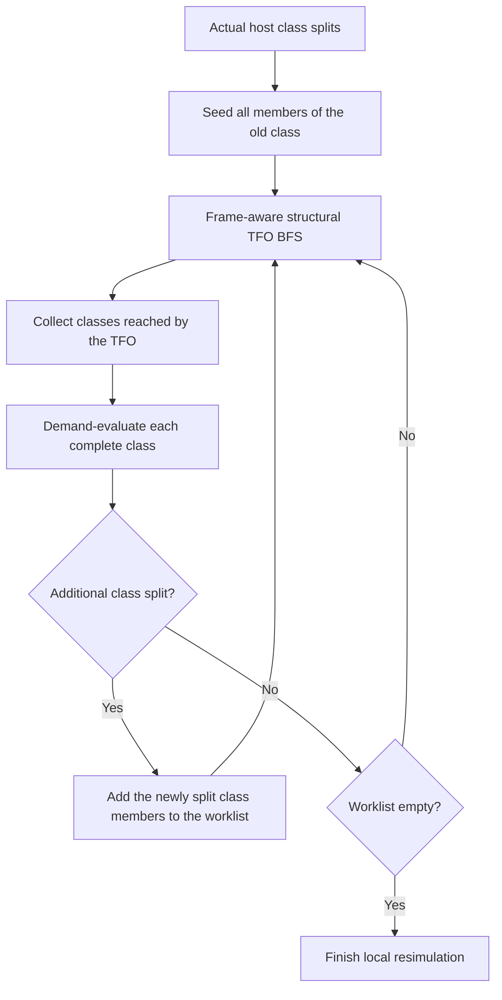
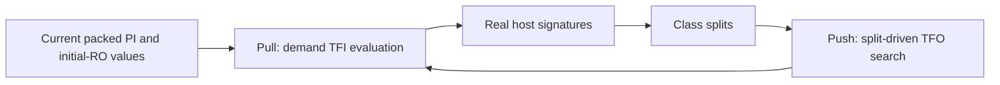

# Incremental SAT and Simulation in `&scorr`

This document describes the baseline ABC `&scorr` loop, the role of the `-i`
incremental SAT filter, and the revised `-I` incremental resimulation design.

The central distinction is:

- SAT solves proof obligations in the speculative reduction model (SRM).
- Resimulation replays SAT counterexamples on the original host AIG.
- Only host-AIG simulation results, timeout handling, and trivial-SAT handling
  modify the host equivalence classes.

## 1. Baseline `&scorr` Loop

`&scorr` repeatedly constructs an SRM, solves its outputs, replays the returned
counterexamples, and refines the host-AIG equivalence classes.



### 1.1 The SRM Is Speculative

When the SRM recursively constructs a node, a class member may be replaced by
its representative:

```text
member -> representative
```

The SRM output for a candidate pair therefore depends on:

1. the real logic of the two output endpoints;
2. all speculative class substitutions reached in their fanin cones.

A SAT result means that the SRM output can be asserted. It does not necessarily
mean that the two corresponding host-AIG endpoints differ under the same input.

Two cases are possible:

```text
Real endpoint failure:
    host(a, CEX) != host(b, CEX)

Speculative failure:
    SRM(a, CEX) != SRM(b, CEX)
    host(a, CEX) == host(b, CEX)
```

In the second case, at least one speculative equivalence assumption in the SRM
fanin must be false under the CEX.

### 1.2 Meaning of SAT Results

| SAT result | Host class action |
|---|---|
| UNSAT | Keep the pair. The current SRM proved this obligation. |
| Timeout | Conservatively remove the target node from its class. |
| SAT with literals | Replay the CEX on the host AIG. Do not force-split the failed pair. |
| Trivial SAT with no literals | Directly split the target pair because there is no input pattern to replay. |

A normal SAT result may leave the failed output pair merged. The CEX can instead
split an earlier class used speculatively in the SRM fanin. This is why the
`pending` count is not expected to equal the number of CEX records.

## 2. Word-Parallel Host-AIG Resimulation

ABC stores multiple simulation patterns in each machine word:

```text
fanin0 = 10110010...
fanin1 = 01110100...
node   = fanin0 & fanin1
```

One word operation evaluates up to 32 patterns. In baseline full resimulation,
ABC evaluates every relevant AIG node in topological order for every frame:

```text
cost approximately O(frames * AIG nodes * simulation words)
```

Each bit lane represents one coherent host input assignment:

- frame-0 register outputs come from the initialized state;
- primary inputs come from the current packed simulation batch;
- later register outputs come from the previous frame's register inputs.

The CEX lanes and random filler lanes are propagated through the entire host
AIG. Equivalence classes are regrouped using the resulting signatures.

## 3. Incremental SAT Filtering with `-i`

The `-i` option does not use SAT-failed pairs as its next-round seeds.

It snapshots the host equivalence classes when the current SRM is built. After
SAT handling and host resimulation, it compares the new class structure with
that snapshot:

```text
SRM class snapshot
        |
SAT timeout/trivial handling + host resimulation
        |
actual host class changes Delta C
        |
TFO(Delta C)
        |
next-round SRM outputs that must be re-proved
```

Pairs outside this dependency region keep the same speculative formula, so
their previous UNSAT result can be reused.

### 3.1 Why Alias Dependencies Are Required

Structural fanout alone is insufficient. SRM construction can directly replace
a member with its representative:

```text
representative -> member
```

This is a logical dependency even when there is no host-AIG fanout edge between
the two nodes. If a representative-related class changes, the speculative
formula for an aliased member can also change.

The corrected `-i` traversal therefore includes:

- ordinary host-AIG fanout edges;
- register-input to next-frame register-output edges;
- representative-to-member alias edges;
- ring-edge changes when ring mode is enabled.



## 4. Why Failed-Endpoint TFO Was Not Sufficient for `-I`

The earlier `-I` implementation treated the failed SRM endpoints as simulation
seeds and evaluated their TFO.

That direction is not sufficient because a failed endpoint is an observation
point, not necessarily the cause of the failure. The violated equivalence can
be in the speculative TFI of that output.

The earlier implementation also used SAT endpoint values as host-AIG cutpoint
values. These values belong to SRM literals and are not guaranteed to equal the
real host-AIG endpoint values under the CEX.

The revised implementation therefore removes SAT endpoint-value extraction
from the main `&scorr` path.

## 5. Revised `-I`: CEX Diagnosis Followed by Split-Driven TFO

The revised design has two distinct phases.

### Phase A: Diagnose Every Failed CEX

For each failed SRM output and its packed CEX lane:

1. Record the exact failed host pair.
2. Reproduce the speculative recursion used to build the SRM output.
3. Record each encountered `member -> representative` assumption.
4. Demand-evaluate the required host nodes from the current CEX inputs.
5. Check the exact failed pair and every recorded speculative assumption.
6. Regroup the corresponding host classes using real host-AIG signatures.



Diagnosis is lane-specific. A CEX lane is considered explained only when:

- its exact failed host pair differs; or
- one of the exact speculative assumptions used by that CEX differs; or
- that exact relation was already removed by another valid split in the same
  packed batch.

It is not enough for an unrelated member of the same large class to split.

If any real CEX lane remains unexplained, local resimulation is abandoned and
the batch falls back to standard full host-AIG resimulation.

### Phase B: Search the TFO of Actual Splits

Only classes that really split under coherent host-AIG values become TFO seeds.



This second phase is an opportunistic search using the same valuable CEX batch.
It is not needed to explain the original SRM failure, but it can expose more
downstream inequivalences and reduce later SAT iterations.

Class regrouping is performed on complete current classes. The implementation
does not modify a class while iterating an incomplete member subset.

## 6. Demand Evaluation and Bit Parallelism

The revised `-I` still uses word-parallel simulation.

The packed batch contains two kinds of lanes:

- real SAT CEX lanes, tracked by `CexMask` for exact diagnosis coverage;
- random filler lanes generated by the standard ABC packing path.

All lanes except bit 0 participate in class refinement. Bit 0 remains the
deterministic phase anchor copied from the most recent full sweep. Keeping the
random filler lanes preserves the opportunistic refinement available in
baseline full simulation within the selected local cones.

A host node is evaluated only when diagnosis or split-TFO refinement requests
it. Evaluation is node-at-a-time and word-parallel:

```c
for (w = 0; w < nWords; w++)
    node[w] = fanin0[w] & fanin1[w];
```

Each `(frame, node)` is traversed at most once per packed batch. A per-key
version stamp records whether all words of that node are current, so no dense
per-lane validity array is required.

The implementation combines:

- pull evaluation for the TFI needed to compute real host values;
- push traversal for the TFO of classes that actually split.



Unlike full simulation, this approach does not have a single contiguous
topological sweep. It retains bit-level parallelism but trades some locality
for a smaller evaluated node set.

## 7. Fallback Conditions

Local diagnosis has a larger constant factor than the linear full sweep.
Therefore the implementation performs two cheap 10% prechecks before changing
any equivalence class:

1. a speculative union-TFI shape check for the failed endpoints;
2. a real host-TFI closure check for every complete class that diagnosis may
   need to evaluate.

The second check is important because a small speculative cone can still touch
a large equivalence class whose complete regrouping requires a wide real TFI.
Rejecting that case early avoids paying for a large partial local simulation
and then paying again for the full sweep.

The local path falls back to standard full resimulation when any of the
following occurs:

- this is the first batch and no full-simulation phase anchors exist yet;
- a real CEX lane cannot be explained by the exact pair or its speculative TFI;
- either early diagnosis/evaluation shape exceeds 10% of the unrolled host AIG;
- the detailed lane-aware diagnosis exceeds the 60% hard limit;
- the split-driven TFO exceeds 60%;
- the actual demand-evaluated host closure exceeds 60%;
- required mapping or input information is incomplete.

The 10% prechecks run before class mutation. A later 60% hard-limit fallback may
occur after valid splits; the standard full resimulation then continues from
that already refined partition.

## 8. Relationship Between `-I` and `-i`

The two options operate at different stages:

```text
-I:
SAT CEX
  -> speculative-TFI diagnosis
  -> real host class splits
  -> optional split-driven TFO simulation search

-i:
real host class changes
  -> structural and alias-aware TFO
  -> next-round SRM outputs that must be re-proved
```

`-I` discovers and expands real simulation refinements.

`-i` converts the resulting class changes into a correct incremental SAT
re-proof set.

## 9. Implementation Map

- Main `&scorr` iteration, SRM construction, SAT result handling, and CEX
  packing: `src/proof/cec/cecCorr.c`
- Incremental SAT dependency traversal for `-i`:
  `src/proof/cec/cecCorrIncr.c`
- CEX diagnosis, demand host evaluation, class regrouping, and split-TFO search
  for `-I`: `src/proof/cec/cecCorrIncrSim.c`
- Manager definitions and interfaces: `src/proof/cec/cecInt.h`

The `incre_sim_seed_v2` branch is based on the corrected
`codex/debug-i-shadow-oracle` history, so the alias-aware `-i` fixes remain part
of this implementation.
